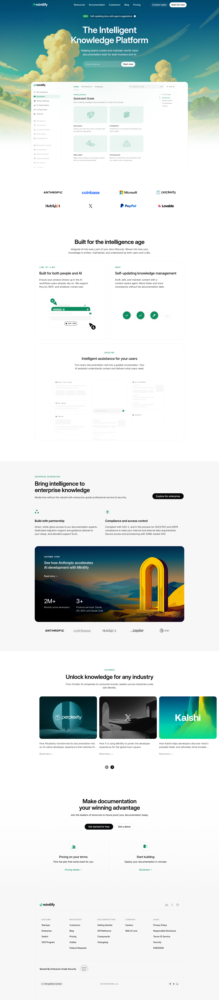

# Mintlify Homepage Clone

## Overview
This project is a complete clone of the Mintlify.com homepage built using pure HTML, CSS, and vanilla JavaScript.
It is created as part of the Web Dev Cohort 2026 assignment.

The landing page features a modern light theme design with illustrated hero section, transparent header with blur effect,
horizontal scrolling customer stories, and comprehensive footer sections.

## Project Structure
```
documentation-website-mintlify/
├── index.html          # Main HTML file
├── styles.css          # All styling
├── README.md           # Project documentation
└── assets/
    ├── mintlify-wordmark.svg
    ├── bg-light.svg
    ├── dashboard.png
    ├── trustedcompany.png
    ├── perplexity.webp
    ├── x.webp
    ├── kalshi.webp
    └── etc.
```

## Setup Instructions
1. Clone or download this repository
2. Open `index.html` in any modern web browser
3. No build process or dependencies required

---

# Mintlify Clone Website :


---

# Mintlify Website :



## Author
Harshil Prajapati