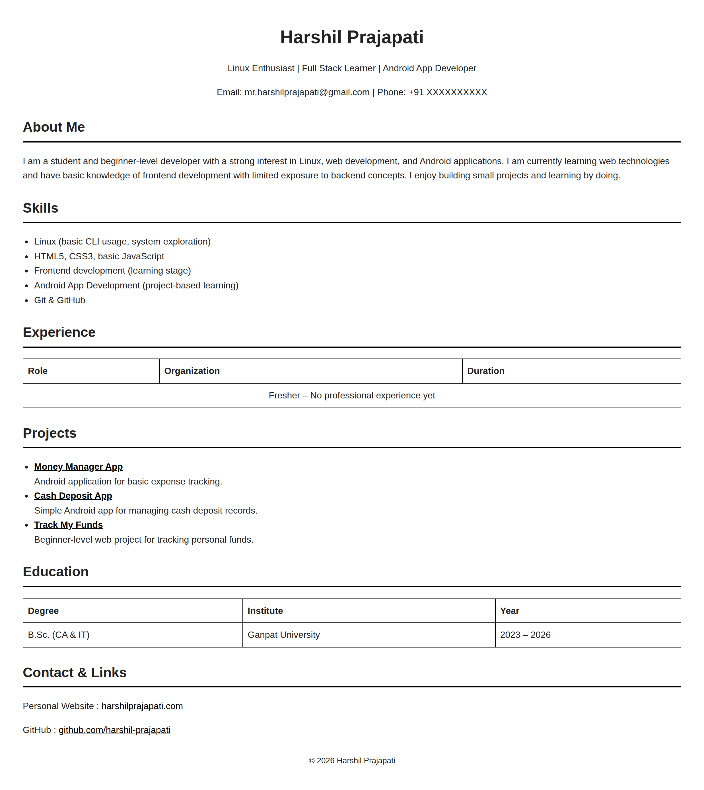

# HTML Resume Page

## Overview
This project is a single-page resume website built using pure HTML and basic CSS.
It is created as part of the Web Dev Cohort 2026 assignment.

The resume represents a beginner-level developer profile with honest skill representation
and real project links.

## Setup Instructions
1. Clone or download this repository
2. Open `index.html` in any modern web browser

## Demo
- Screenshots are included in the repository

## Author
Harshil Prajapati